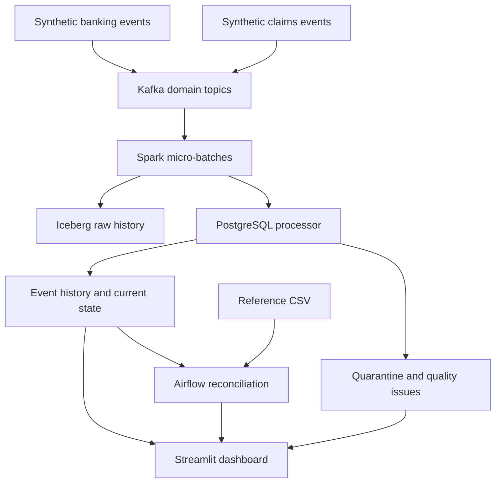

# Architecture and decisions

## Storage and delivery guarantees

Bronze Iceberg retains raw records keyed by Kafka topic/partition/offset. SQL contains
validated event history, current entities, raw ingestion outcomes, and reconciliation
reports. A separate snapshot job exports silver entities and gold current totals to
Iceberg. Local Iceberg uses a Hadoop catalog on a Docker volume.

Iceberg and PostgreSQL are independent transactional systems. The raw-lake merge
finishes first, followed by individual atomic SQL event/state transactions. Spark
acknowledges the batch only after all work completes. A crash can leave the lake
temporarily ahead; retries converge through idempotent writes. This is **at-least-once
delivery with idempotent effects**, not global exactly-once transactions.

## Late events and state

Each entity starts at sequence 1. Reconstruction follows source sequence. Missing
predecessors leave pending/partial state; their arrival recomputes history. Timestamp
regressions are flagged. No watermark discards late business events: durable SQL
stores lifecycle state and deduplication keys. History grows and per-entity rebuild
cost grows with it. Impossible transitions remain visible in history with an issue;
schema/identity/sequence conflicts are quarantined. Corrections to accepted history
require an explicit audited correction model; silent replacements are unsupported.

## Scale boundary

Kafka uses entity keys. Spark reads at most 500 offsets per trigger. A **single driver
writer** serially applies relational transactions; this is a bounded portfolio workload,
not measured bank-scale throughput. Multiple processors against one store are unsupported.
Scale-out requires partition-aware writers, bulk database operations, locking/upserts,
retention policies, and load testing. Stop the stream before replay/rebuild into the
same database. Never reset Kafka volumes alone while retaining checkpoints and lake keys.

## AI

Two deterministic Isolation Forest models use synthetic lognormal amount baselines.
The feature is log(1 + amount in dollars). Seed/configuration and model version are
fixed in source. Higher score means more unusual amount. Training contamination of
2% is a demo threshold, not a verified false-positive rate. Event scores preserve model
version. Extreme-vs-typical tests verify behavior, not real fraud detection effectiveness.
No patient outcomes or clinical decisions are modeled.

## Scope and security

Healthcare events represent claim processing; no HL7, FHIR, X12 837 or X12 835 parser
is claimed. Data is synthetic. Contracts reject extra fields, but this is not a
 de-identification system: raw quarantine can retain arbitrary rejected payloads.
Do not supply real sensitive data. Local ports bind to localhost. PostgreSQL is internal.
Kafka is plaintext and dashboard has no login. `.env` is ignored; sample credentials
are explicitly local demo values. External deployment requires identity, TLS,
least-privilege roles, secrets, retention, backups, and security review.

## Cloud option

Use Hadoop catalog only with local filesystem storage. The Spark builder supports an
existing REST catalog through `ICEBERG_REST_URI` and S3 warehouse through
`ICEBERG_WAREHOUSE`, with S3FileIO and the Iceberg AWS bundle. Prefer workload identity.
No catalog, IAM, or AWS resources are provisioned here; this path is unverified.

## Why both domains?

Both need event history, exact monetary values, state transitions, quality checks,
and reconciliation. Their state machines remain separate. Interviews can focus on
bank settlement or healthcare remittance while showing the same engineering foundations.
